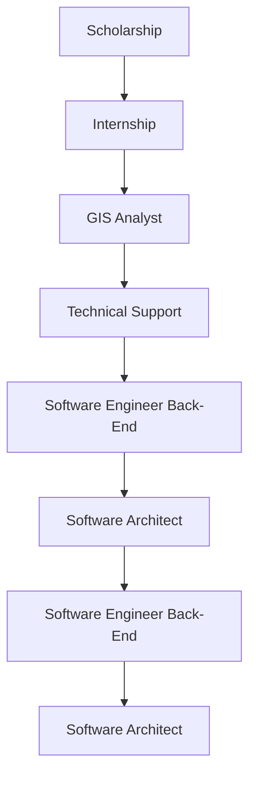

```mermaid
graph TD;
   Scholarship["Scholarship"]
   Internship["Internship"]
   GISAnalyst["GIS Analyst"]
   TechSupport["Technical Support"]
   SoftwareEngineerJava["Software Engineer Back-End"]
   SoftwareArchitectA["Software Architect"]
   SoftwareEngineerPython["Software Engineer Back-End"]
   SoftwareArchitectB["Software Architect"]


   Scholarship --> Internship
   Internship --> GISAnalyst
   GISAnalyst --> TechSupport
   TechSupport --> SoftwareEngineerJava
   SoftwareEngineerJava --> SoftwareArchitectA
   SoftwareArchitectA --> SoftwareEngineerPython
   SoftwareEngineerPython --> SoftwareArchitectB

```